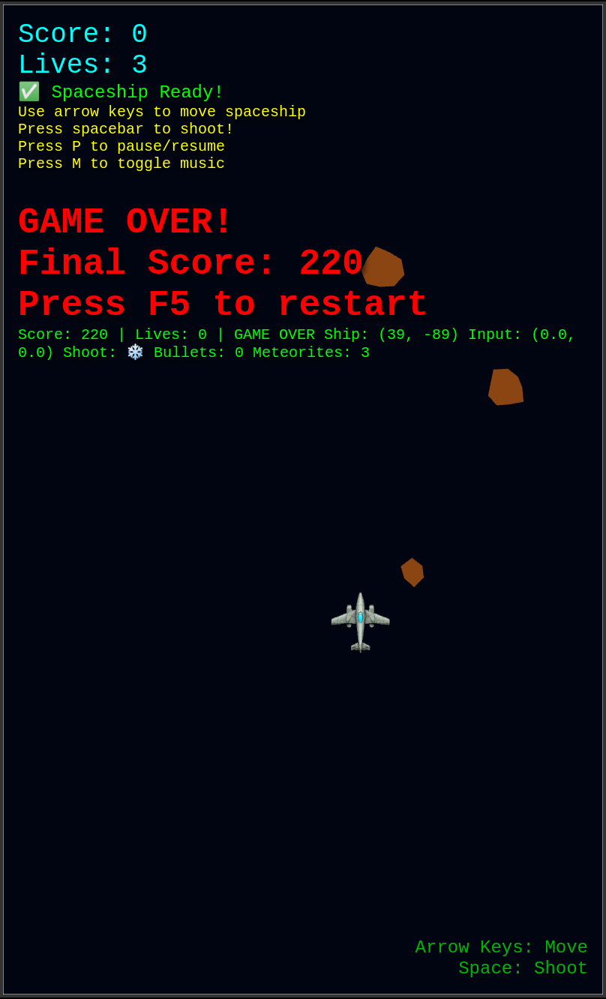

# 🚀 2D Space Shooter Game

A modern, browser-based 2D space shooter game built with TypeScript and Three.js. Features realistic sound effects, smooth controls, and engaging gameplay mechanics.


## 📸 Game Screenshots

{:width=50%}

---

## 🎮 Game Features

### Core Gameplay
- **Space Combat**: Control a fighter jet spaceship to shoot falling meteorites
- **Dense Shooting**: Fast-paced action with 100ms bullet cooldown
- **Collision Detection**: Precise rectangle-based collision system
- **Score System**: +10 points for destroying meteorites, -5 for taking damage
- **Lives System**: Start with 3 lives, game over when depleted
- **Pause/Resume**: Press 'P' to pause and resume gameplay

### Controls
- **Arrow Keys**: Move spaceship in all directions
- **Spacebar**: Fire bullets (hold for continuous shooting)
- **P Key**: Pause/Resume game
- **M Key**: Toggle background music

### Audio System
- **Realistic Explosions**: Multi-layered grenade/artillery-style explosion sounds
- **Dynamic Sound Effects**: Procedurally generated shooting, explosion, and hit sounds
- **Background Music**: Auto-plays on first movement, supports custom audio files
- **Web Audio API**: Advanced audio synthesis for realistic sound effects

### Visual Features
- **Realistic Fighter Design**: Detailed jet-inspired spaceship silhouette
- **Particle Effects**: Meteorites with rotation and random sizes
- **Optimized Rendering**: Smooth 60 FPS gameplay with Three.js
- **Responsive Canvas**: 400x660px arcade-style display

## 🛠️ Installation

### Prerequisites
- Node.js (version 16 or higher)
- npm or yarn package manager

### Quick Start

1. **Clone the repository**
   ```bash
   git clone https://github.com/kaige/spaceship-game.git
   cd spaceship-game
   ```

2. **Install dependencies**
   ```bash
   npm install
   ```

3. **Start development server**
   ```bash
   npm run dev
   ```

4. **Open your browser**
   Navigate to `http://localhost:3000` to start playing!

### Production Build

```bash
# Build for production
npm run build

# Preview production build
npm run preview
```

## 📁 Project Structure

```
spaceship-game/
├── src/
│   ├── GameObjects/              # Game entity classes
│   │   ├── Spaceship.ts         # Player fighter jet
│   │   ├── Bullet.ts            # Bullet projectiles
│   │   └── Meteorite.ts         # Enemy meteorites
│   ├── Systems/                  # Game logic systems
│   │   ├── AudioSystem.ts       # Sound synthesis and playback
│   │   ├── BulletSystem.ts      # Bullet management and spawning
│   │   ├── CollisionSystem.ts   # Collision detection logic
│   │   ├── InputSystem.ts       # Keyboard input handling
│   │   └── MeteoriteSystem.ts   # Meteorite spawning and management
│   ├── types/                    # TypeScript type definitions
│   │   ├── GameTypes.ts         # Game configuration and interfaces
│   │   └── InputTypes.ts        # Input system types
│   ├── utils/                    # Utility functions
│   │   └── TextureLoader.ts     # Asset loading system
│   └── main.ts                   # Game entry point and main loop
├── public/                       # Static assets
│   ├── assets/
│   │   ├── images/              # Game textures
│   │   └── audio/               # Audio files
│   └── index.html               # Main HTML file
├── package.json                 # Dependencies and scripts
└── README.md                    # This file
```

## 🔧 Technology Stack

### Frontend Framework
- **TypeScript**: Type-safe JavaScript development
- **Three.js**: 3D graphics library for 2D rendering
- **Vite**: Fast development server and build tool

### Audio Technology
- **Web Audio API**: Advanced audio synthesis and processing
- **Procedural Sound Generation**: Dynamic sound effects without external files
- **Multi-layer Audio**: Complex explosion sounds with multiple components

### Development Tools
- **ESLint**: Code linting and formatting
- **TypeScript Compiler**: Type checking and compilation
- **Hot Module Replacement**: Instant development updates

## 🎯 Technical Implementation Details

### Game Architecture
The game follows a **Component-Based Architecture** with clear separation of concerns:

1. **Game Objects**: Entity classes with position, velocity, and rendering
2. **Systems**: Logic processors that update game objects
3. **Event System**: Decoupled communication between components
4. **State Management**: Centralized game state handling

### Rendering System
- **Orthographic Camera**: 2D projection with z-layering
- **Custom Shapes**: Procedurally generated game objects
- **Sprite Support**: Texture loading for custom graphics
- **Performance Optimized**: Efficient rendering pipeline

### Audio Synthesis
The explosion sounds are synthesized using multiple audio sources:

```typescript
// 1. Initial crack - high frequency white noise
// 2. Main boom - dual oscillators with frequency sweep
// 3. Debris scattering - metallic clinking sounds
// 4. Echo effect - delayed reflection for distance
```

### Collision Detection
- **Rectangle-Based**: Efficient AABB collision detection
- **Spatial Optimization**: O(1) lookup for active objects
- **Precise Timing**: Frame-perfect collision resolution

## 🎨 Customization

### Adding Custom Graphics
1. Create a 64x64px PNG image with transparent background
2. Name it `fighter.png` and place in `public/assets/images/`
3. Game will automatically load and use your custom fighter

### Adding Custom Audio
1. Prepare audio files (MP3, OGG, or WAV format)
2. Place in `public/assets/audio/`:
   - `background-music.mp3` - Background music
3. Game will automatically detect and load custom audio

### Configuration
Edit `src/types/GameTypes.ts` to modify game parameters:
```typescript
export const GAME_CONFIG: GameConfig = {
    canvasWidth: 400,
    canvasHeight: 660,
    backgroundColor: 0x000511
};
```

## 🐛 Troubleshooting

### Common Issues

**Audio Not Playing:**
- Modern browsers require user interaction before playing audio
- Click anywhere on the game or press any key to enable audio
- Check browser permissions for audio playback

**Performance Issues:**
- Ensure hardware acceleration is enabled in browser
- Close other browser tabs for better performance
- Check system resources if experiencing lag

**Controls Not Working:**
- Make sure the game window has focus
- Click on the game canvas to capture keyboard input
- Check browser developer console for error messages

### Development Mode
Run `npm run dev` for hot-reloading development with detailed console logging.

## 🚀 Future Enhancements

Potential features for future development:
- [ ] Power-ups and special weapons
- [ ] Different enemy types with AI behavior
- [ ] Particle effects for explosions
- [ ] High score system with local storage
- [ ] Multiple levels with increasing difficulty
- [ ] Mobile touch controls
- [ ] Network multiplayer support

## 📄 License

This project is open source and available under the MIT License.

## 🤝 Contributing

Contributions are welcome! Please feel free to submit a Pull Request.

1. Fork the repository
2. Create your feature branch (`git checkout -b feature/AmazingFeature`)
3. Commit your changes (`git commit -m 'Add some AmazingFeature'`)
4. Push to the branch (`git push origin feature/AmazingFeature`)
5. Open a Pull Request

## 📞 Support

If you encounter any issues or have questions, please open an issue on the GitHub repository.

---

**Enjoy the game! 🎮**